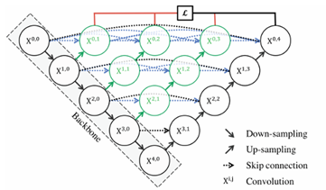
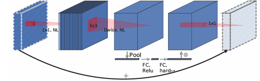
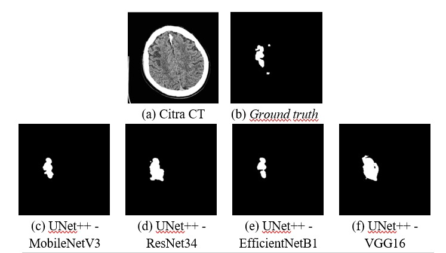
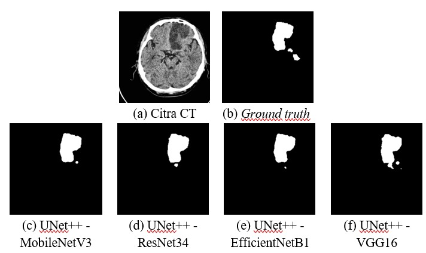

# 🧠 Acute Ischemic Stroke Lesion Segmentation on Head NCCT using UNet++ + MobileNetV3

This project focuses on semantic segmentation of acute ischemic stroke lesions from non-contrast head CT (NCCT) images using a UNet++ architecture with a MobileNetV3 encoder

## ⚠️ The Problem
In acute ischemic stroke, every minute matters. Unfortunately, ischemic lesions on non-contrast CT (NCCT) images are often hard to spot because of low contrast and subtle intensity changes. Manual segmentation is slow and can vary between observers, which makes it less ideal in time-critical situations.

## ⚙️ Method
This project explores an automated approach for segmenting ischemic stroke lesions using a UNet++ model with a MobileNetV3 encoder.

### UNet++ 
Helps **capture details at multiple scales**, which is useful for detecting small and low-contrast lesions.

### MobileNetV3 
Keeps the model **lightweight and fast**, making it more realistic for practical deployment.

## 🏆 Results
The model achieves a good balance between accuracy and efficiency:

- **IoU:** 0.5710  
- **Dice:** 0.7273  
- **Parameters:** 6.9M  
- **Inference time:** ~7.4 ms per image

Examples of lesion segmentation using UNet++ + MobileNetV3 and the other models:

## 📌 Notes
This project uses a publicly available NCCT dataset.

**Data source:**
[GriffinLiang - AISD](https://github.com/GriffinLiang/AISD)

All credits for data collection and annotation belong to the original authors.
The dataset itself is not redistributed in this repository.

## 🌐 Let's Connect!
- **Name:** Muhammad Kamil Dipinto
- **Email:** dipintom3@gmail.com
- **LinkedIn:** [Muhammad Kamil Dipinto](https://www.linkedin.com/in/muhammadkamildipinto/)
